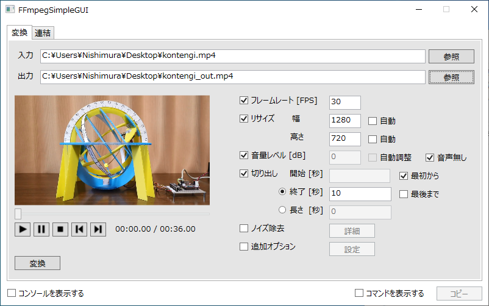
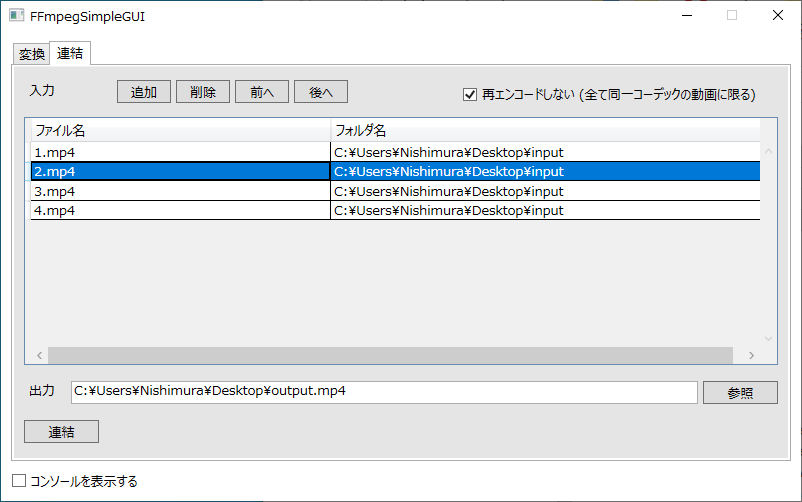

# FFmpegSimpleGUI

* FFmpegの簡易GUIです。 (Windows用)
* 動画の変換と連結に機能を絞っています。
* 動画の変換は基本的なパラメータに機能を絞っています。
* FFmpegは同梱しません。
* ffmpeg.exe にパスが通っていることが前提です。
* Visual Studi 2019 / C# で作成したWPFアプリです。

## スクリーンショット

[変換] の画面

[連結] の画面

